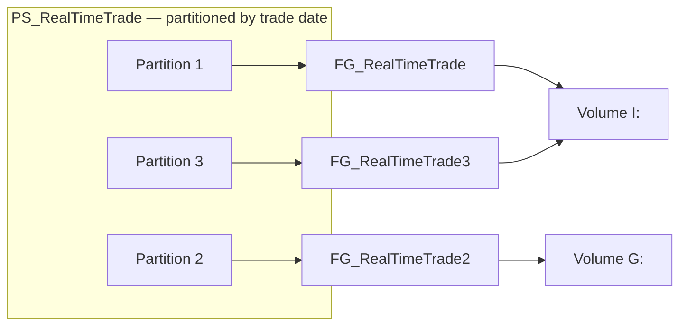

# MarketData.DB

A SQL Server database project for a market-data warehouse — equity prices, quotes,
trades, ETF holdings, SEC 13F filings, Treasury curves and fundamentals — captured
as versioned, compilable source rather than a folder of loose scripts.

This is not a demo schema. It is the live database behind my own market-data and
analytics work, published as-is: the same partitioning, filegroup layout and
storage paths the database actually runs on. Where that makes it specific to my
own server, I have said so rather than genericising it away.

---

## Why a database is in Git at all

Plenty of teams version every line of application code and then keep the database
as a shared folder of `.sql` files, a set of scripts pasted into SSMS, or nothing
at all. The schema is the one part of the system where mistakes are hardest to
undo, and it is routinely the least controlled.

A SQL Server Data Tools (SSDT) project changes that. The schema is declared as
source — one `CREATE` statement per object — and MSBuild **compiles** it. Not a
syntax check: SSDT builds a complete semantic model of the database and resolves
every column, every table reference, and every dependency between objects.

That distinction is the whole argument, and this repository is a concrete example
of it. The first build after extracting this project into its own repo reported:

```
StoredProcedures/ptf.GetPortfolioBackTest.sql: warning SQL71502:
  Procedure [ptf].[GetPortfolioBackTest] has an unresolved reference
  to object [dbo].[portfolio].
```

The table is `[ptf].[Portfolio]`. That procedure reads from a schema it does not
live in, so it cannot run. It had been sitting there unnoticed. **No amount of
keeping `.sql` files in a folder would ever have told me that** — you find out
when someone runs the report and it fails. A compiled database project found it
in twenty seconds without touching a server.

The build currently reports 754 warnings across three classes, and reading them is
a decent short lesson in what the compiler actually knows:

| Code | Count | Meaning | Severity |
|---|---:|---|---|
| `SQL71502` | 26 | Reference does not resolve at all | **Real bug** — see above |
| `SQL71562` | 426 | Reference to an object outside the model — 28 three-part names like `MarketData.pgon.DailySnapshotPrices` hardcode the database name | Deploys, but breaks in any database not named `MarketData` |
| `SQL71558` | 302 | Reference differs only by case from the definition (`dsp.ticker` vs `Ticker`) | Cosmetic under `CI` collation; breaks under a case-sensitive one |

They are listed openly because the point of the exercise is that they are
*visible and countable at all*. See [Known issues](#known-issues).

### A note on the commit history

This history starts in March 2023 and most of the messages are poor — `wip`,
`work2`, `more changes`. It was solo work on a database I run for myself, and the
messages were checkpoints for me rather than communication to anyone else. I have
not rewritten them. Inventing better ones after the fact would make the log
tidier and less true.

They also carry less weight here than they would in an application repo, for a
structural reason. In an SSDT project one file is one database object, and the
filename is that object's fully-qualified name — so the file list *is* the change
description:

```console
$ git show --name-only --format="" 444154c   # subject: "more changes"
Functions/dbo.GetEtfTargetPrices.sql
Functions/dbo.GetLastMarketDate.sql
Functions/dbo.GetTickerWinningStreak.sql
Storage/DailyPriceSnapshotFileGroup.sql
StoredProcedures/dbo.LoadVolumeAnalysis.sql
StoredProcedures/dbo.MoveInvescoEtfHoldingsToHistory.sql
StoredProcedures/dbo.MoveTickerReferenceToArchive.sql
Tables/Etfs/dbo.InvescoEtfHoldings.sql
Tables/Etfs/dbo.InvescoEtfHoldingsHistory.sql
...
30 files changed, 494 insertions(+)
```

The subject says nothing. The diff says ETF holdings tables with history-archival
procedures, a market-calendar function and a winning-streak function were added.
Use `git log --stat` here, not the subject lines.

The history was also extracted from a larger private repository where this
database sat alongside the loaders that feed it, so some messages describe work
that touched code outside this project.

---

## What is in here

166 objects across eight schemas.

| Schema | Contents |
|---|---|
| `pgon` | Price and quote data — daily snapshots, minute bars, real-time trades and quotes, derived analytics views |
| `dbo` | Reference data, ETF holdings, fundamentals, screeners, calendar and market-holiday tables, analytic functions |
| `sec` | SEC 13F filings — submissions, cover pages, info tables, CIK reference |
| `ptf` | Portfolio construction, weights, correlation and backtesting |
| `curve` | Treasury yield curve |
| `nyfed` | NY Fed securities-lending operations |
| `redfin` | Housing-data sitemap ingestion |
| `staging` | Landing tables for bulk load before merge |

### Features worth pointing at

- **Range partitioning** — 5 partition functions and 5 partition schemes over date
  keys, spread across dedicated filegroups (see [Storage layout](#storage-layout))
- **Clustered columnstore** — on the high-volume quote and trade tables, where the
  workload is analytic scans over hundreds of millions of rows
- **In-Memory OLTP** — `pgon.DailySnapShotPricesMemOpt` and
  `pgon.RealTimeTradesMemOpt` are memory-optimized for hot-path ingest
- **SQL CLR user-defined aggregate** — [`CLRFunctions/Correlation.cs`](CLRFunctions/Correlation.cs)
  implements a streaming Pearson correlation as a native aggregate
  (`Init` / `Accumulate` / `Merge` / `Terminate`), so correlation is computable in
  a `GROUP BY` instead of being pulled into the application
- **Window functions** across 28 objects, plus `MERGE` upserts, `CROSS APPLY`,
  `PIVOT`, and audit triggers writing to `dbo.FundamentalsLog`
- **Computed columns** — e.g. `Spread` and `MidPrice` on `pgon.RealTimeQuotes`

---

## Storage layout

**This part is deliberately specific to my own server, and is committed that way
on purpose.** The filegroup and file definitions under [`Storage/`](Storage) carry
real paths on real volumes:

```sql
ALTER DATABASE [$(DatabaseName)]
    ADD FILE (
        NAME = [MinutePrice2],
        FILENAME = 'G:\Db\MinutePrice2.ndf',
        SIZE = 1000MB, MAXSIZE = UNLIMITED, FILEGROWTH = 1000MB
    ) TO FILEGROUP FG_MinutePrice2;
```

I have left the real values in rather than swapping in placeholders, because the
layout *is* the design — blanking it out would hide the reasoning along with the
paths. The database is spread across two dedicated data volumes, `I:` and `G:`,
with roughly 158 GB pre-allocated:

| Filegroup | File | Volume | Size |
|---|---|---|---:|
| `FG_RealTimeQuotes` | `RealTimeQuotes_Data.ndf` | `I:` | 50 GB |
| `ExchangeQuoteFileGroup1` | `ExchangeQuoteFile1.ndf` | `I:` | 20 GB |
| `ExchangeQuoteFileGroup2` | `ExchangeQuoteFile2.ndf` | `G:` | 20 GB |
| `ExchangeQuoteFileGroup3` | `ExchangeQuoteFile3.ndf` | `I:` | 20 GB |
| `ExchangesQuotesFileGroup1` | `StagingExchangesQuotesFIle1.ndf` | `I:` | 20 GB |
| `ExchangesQuotesFileGroup2` | `StagingExchangesQuotesFile2.ndf` | `G:` | 10 GB |
| `FG_RealTimeTrade` | `RealTimeTrade.ndf` | `I:` | 4 GB |
| `FG_RealTimeTrade2` | `RealTimeTrade2.ndf` | `G:` | 4 GB |
| `FG_RealTimeTrade3` | `RealTimeTrade3.ndf` | `I:` | 4 GB |
| `SecurityCorrelations` | `SecurityCorrelationsFile.ndf` | `I:` | 4 GB |
| `FG_MinutePrice` | `MinutePrice.ndf` | `I:` | 1 GB |
| `FG_MinutePrice2` | `MinutePrice2.ndf` | `G:` | 1 GB |

Sizes are pre-allocated with explicit `FILEGROWTH` rather than left on defaults,
so the files are not autogrowing in small increments in the middle of an ingest.

### Why the partitions alternate volumes

The partition schemes map **consecutive partitions onto different physical
volumes**:

```sql
CREATE PARTITION SCHEME [PS_RealTimeTrade]
    AS PARTITION [PF_RealTimeTrade]
    TO ([FG_RealTimeTrade], [FG_RealTimeTrade2], [FG_RealTimeTrade3]);
--        I:                  G:                  I:
```



Adjacent date partitions are exactly what a range scan or a concurrent ingest
touches at the same time, so placing neighbours on separate volumes spreads that
I/O across spindles instead of queueing it all on one. `PS_MinutePrice` and
`PS__StagingExchangesQuotes` follow the same alternating pattern.

### If you want to deploy this yourself

You will need to change the paths — `G:\Db\` and `I:\Db\` will not exist on your
machine, and deployment fails if the directories are missing. Two options:

1. Edit the `FILENAME` values under [`Storage/`](Storage) to match your volumes.
2. Replace them with an SQLCMD variable (`$(DataPath)`) declared in the `.sqlproj`
   and pass your own path at publish time. This is the cleaner route and is on the
   [roadmap](#roadmap); the surrounding `ALTER DATABASE [$(DatabaseName)]`
   statements already use exactly this mechanism.

The connection string in `MarketData.DB.publish.xml` ships as a placeholder
(`Data Source=YOURSERVER`) rather than my own instance. Point it at your server
before publishing.

---

## Building

The project produces a **`.dacpac`** — one compiled artifact containing the entire
schema plus the compiled CLR assembly.

```bash
msbuild MarketData.DB.sqlproj /t:Build /p:Configuration=Release
```

Output: `bin/Release/MarketData.DB.dacpac`.

Requires Visual Studio 2022 with SQL Server Data Tools, or the standalone SSDT
build targets, since this is a classic-format `.sqlproj`. Opening
`MarketData.DB.sln` in Visual Studio works too.

---

## Deploying

This is the part that tends to surprise people who have only ever deployed
databases by hand-writing migration scripts.

**You never write `ALTER TABLE`.** You change the `CREATE TABLE` in source, build
a dacpac, and the deployment tool compares that dacpac against the live database
and *generates* the difference itself — new columns, dropped indexes, altered
types, with ordering and dependencies worked out for you.

### 1. Visual Studio

Right-click the project → **Publish**, using `MarketData.DB.publish.xml`. Best for
iterating. **Generate Script** instead of Publish shows the exact migration before
anything runs — worth doing every time against anything you care about.

### 2. SqlPackage — the one that matters

`SqlPackage.exe` is the command-line engine underneath the Visual Studio publish,
and it is what every CI/CD system actually invokes:

```bash
SqlPackage /Action:Publish /SourceFile:"bin/Release/MarketData.DB.dacpac" /TargetServerName:"YOURSERVER" /TargetDatabaseName:"MarketData" /p:BlockOnPossibleDataLoss=True
```

Produce the migration script for review instead of executing it:

```bash
SqlPackage /Action:Script /SourceFile:"bin/Release/MarketData.DB.dacpac" /TargetServerName:"YOURSERVER" /TargetDatabaseName:"MarketData" /OutputPath:"migration.sql"
```

Keep `BlockOnPossibleDataLoss=True`. It aborts rather than silently dropping a
column that still holds data.

### 3. TeamCity / Azure DevOps / GitHub Actions

All three reduce to the same two steps — MSBuild the `.sqlproj`, then run
`SqlPackage`. A TeamCity configuration is just:

| Step | Runner | What it does |
|---|---|---|
| 1. Build | MSBuild | `MarketData.DB.sqlproj`, target `Build`, configuration `Release` |
| 2. Artifact | — | publish `bin/Release/MarketData.DB.dacpac` |
| 3. Deploy | Command Line | `SqlPackage /Action:Publish /SourceFile:...` |

Build once, then deploy the same artifact to each environment in turn. Because the
dacpac is declarative, that identical artifact produces a *different* migration
script per environment, matched to whatever state each one is actually in.

### The `.refactorlog`

[`MarketData.DB.refactorlog`](MarketData.DB.refactorlog) is committed on purpose,
and it is easy to lose by accident. It records renames. Without it, renaming a
column looks to the diff engine like *drop the old one, add a new one* — which
silently destroys the data in it. With it, deployment emits `sp_rename` and the
data survives. Any process that discards it is not safely deployable.

---

## Known issues

Kept visible rather than quietly fixed, since the compiler surfacing them is the
whole point.

- **`ptf.GetPortfolioBackTest` references `dbo.portfolio`**, but the table is
  `ptf.Portfolio`. The procedure is broken and needs the schema corrected.
- **`FG_RealTimeQuotes` is allocated but unused.** It reserves 50 GB, while
  `PS_QuoteDate` is declared `ALL TO ([PRIMARY])` — so `pgon.RealTimeQuotes` and
  its clustered columnstore actually land on PRIMARY.
- **`pf_QuoteDate` has fixed boundaries ending 2026-02-23.** As a `RANGE RIGHT`
  function, every row after that date falls into a single ever-growing final
  partition. It needs a sliding-window maintenance job that rolls boundaries
  forward and ages old partitions out.
- **28 three-part references hardcode the `MarketData` database name**
  (`dbo.GetPriceLow`, `dbo.GetPriceHighLow`, `dbo.test`). They should be two-part
  names so the project deploys under any database name.
- **302 case-mismatch warnings.** Harmless under the project's `1033, CI`
  collation, but they would become errors on a case-sensitive server.
- **`dbo.test`** is an unfinished procedure — nine near-identical
  `INSERT ... SELECT TOP 1` blocks differing only by `DATEADD` interval. It wants
  a real name and a `CROSS APPLY` over an intervals table.
- **`Tables/Fundamentals/dbo_1.PE.sql`** contains a trigger, not a table — an SSDT
  filename-collision artifact.
- **Storage paths are machine-specific**, as described above. Moving them to an
  SQLCMD variable is the intended fix.

## Roadmap

- Convert to the SDK-style `Microsoft.Build.Sql` project format, so the project
  builds with `dotnet build` on any platform without Visual Studio
- CI that builds the dacpac on every push
- `$(DataPath)` SQLCMD variable for the filegroup paths
- Sliding-window partition maintenance for `pf_QuoteDate`
- tSQLt unit tests
